# Unity Geliştiricileri İçin Kullanışlı Linux Komutları

## Amaç
Bu dokümanın amacı, Unity geliştiricilerine yönelik olarak Linux işletim sisteminde sıkça kullanılan ve geliştirme sürecini optimize edebilecek komutları kapsamlı bir şekilde sunmaktır. Bu kaynak, geliştiricilerin proje yönetimi, performans izleme ve sistem yapılandırması gibi alanlarda verimliliklerini artırmalarına yardımcı olmayı hedeflemektedir.

Not: Bu döküman yapılırken Linux dağıtımlardan LinuxMint 20.1 yüklü olduğunu varsayıyoruz.

## İçerik
|Sıra|Komut|Açıklama|Aileye Ait|
|:---:|:---:|:---:|:---:|
| 1 | [`cd`](#cd-komutu) | Dizinler arasında geçişi sağlar. | `cd`, `cd ..`, `cd ~`, `cd /`|
| 2 | [`ls`](#ls-komutu) | Dizinlerin içeriğini gösterir. | `ls`, `ls -l`, `ls -a`, `ls -la`, `ls -lh`, `ls -R`, `ls -t`, `ls -S` |
| 3 | [`pwd`](#pwd-komutu) | Bulunduğumuz diziyi gösterir. | `pwd`, `pwd -P` |
| 4 | [`cp`](#cp-komutu) | Dosya veya klasörü koplayalar. | `cp dosya_adi yeni_yol`, `cp -r klasör_adi yeni_yol` |
| 5 | [`mv`](#mv-komutu) | Dosya veya klasörü taşır. | `mv dosya_adi yeni_yol`, `mv -r klasör_adi yeni_yol` |
| 6 | [`rm`](#rm-komutu) | Dosya veya klasörü silmede kullanılır. | `rm dosya_adi`, `rm -r klasor_adi` |
| 7 | [`mkdir`](#mkdir-komutu) | Klasör oluşturmada kullanılır. | `mkdir klasor_adi`, `mkdir -p klasor_adi/klasor_adi` |
| 8 | [`touch`](#touch-komutu) | Dosya oluşturmada kullanılır. | `touch dosya_adi`, `touch -a dosya_adi` |
| 9 | [`ip`](#ip-komutu) | Bilgisayarın IP adresini gösterir. | `ip` |
| 10 | [`grep`](#grep-komutu) | Doyyada ki belirli bir kelimeyi arar. | `grep -R`, `grep -R -i` |
| 11 | [`cat`](#cat-komutu) | Dosya okumamıza olanak sağlar. | `cat dosya_adi`, `cat -n dosya_adi` |
| 12 | [`ps`](#ps-komutu) | Bilgisyarda ki oturumları gösterir. | `ps`, `ps aux`, `ps -u`, `ps -u -e` |
| 13 | [`ls -R --color=auto`](#ls--r---colorauto-komutu) | Dosyaları ve alt klasörleri gösterir. | `ls -R --color=auto` |
| 14 | [`lsmod`](#lsmod-komutu) | Modüllerin listesini gösterir. | `lsmod`, `modinfo modül_adi` |
| 15 | [`gzip`](#gzip-komutu) | Dosya sıkıştırmada kullanılır. | `gzip` |
| 16 | [`gunzip`](#gunzip-komutu) | Sıkıştırılmış dosyayı açar. | `gunzip` |
| 17 | [`traceroute`](#traceroute-komutu) | Paketin sunucuya gittiği yolda ki tüm IP adreslerini gösterir. | `traceroute` |
| 18 | [`cat`](#cat-komutu) | Dosya okumada kullanılıyor. | `cat`, `cat -n`, `cat >`, `cat +>` |
| 19 | [`df`](#df-komutu) | Dosya sistemini gösterir. | `df`, `df -h`, `df /home`, `df -T`, `df -i`, `df -P` |
| 20 | [`du`](#du-komutu) | Dosya ve klasörlerin boyutlarını bize gösterir. | `du`, `du -h`, `du -s`, `du -a`, `du -sh`, `du -hc` |
| 21 | [`dd if=/dev/zero of=testfile bs=1M count=1024 oflag=direct`](#dd-ifdevzero-oftestfile-bs1m-count1024-oflagdirect-komutu) | Basit ve hızlı bir test için kullanılabilir. | `dd if=/dev/zero of=testfile bs=1M count=1024 oflag=direct` |
| 22 | [`iozone -I`](#iozone--i-komutu) | Farklı dosya boyutları ve erişim desenleri için performans testleri yapar. | `iozone -I` |
| 23 | [`exit`](#exit-komutu) | Terminal penceresini kapatır. | `exit` |
| 24 | [`time wget https://speed.hetzner.de/100MB.bin`](#time-wget-httpsspeedhetznerde100mbbin-komutu) | Hetzner'in 100 MB'lık bir dosyasını indirir ve geçen süreyi gösterir. | `time wget https://speed.hetzner.de/100MB.bin` |
| 25 | [`time curl -o /dev/null https://speed.hetzner.de/100MB.bin`](#time-curl--o-devnull-httpsspeedhetznerde100mbbin-komutu) | Hetzner'in 100 MB'lık bir dosyasını indirir ve geçen süreyi daha detaylı gösterir. | `time curl -o /dev/null https://speed.hetzner.de/100MB.bin` |
| 26 | [`free`](#free-komutu) | Bellek ile ilgili bilgi verir. | `free`, `free -m` |
| 27 | [`top`](#free-komutu) | Sistemdeki işlemleri gösteriyor. | `top`, `top -c`, `top -u` |
| 28 | [`htop`](#htop-komutu) | Sistemdeki işlemleri daha detaylı gösteriyor. | `htop` |

## Unity Hub Kurulumu
Unity oyun motoru ile geliştirme yapabilmek için Unity Hub programını kurmak gerekli. Kurulumu adım adım anlatmakta fayda var. 

### 1. Adım
Ortak imzalama anahtarını eklemek için aşağıdaki komutu çalıştırın:
```bash
wget -qO - https://hub.unity3d.com/linux/keys/public | gpg --dearmor | sudo tee /usr/share/keyrings/Unity_Technologies_ApS.gpg > /dev/null
```
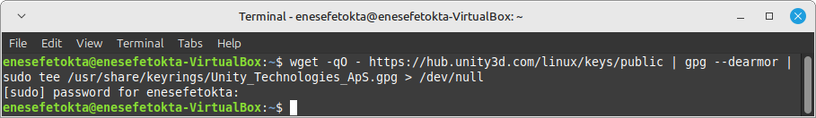

### 2. Adım
Unity Hub deposunu eklemek için /etc/apt/sources.list.d dosyasına bir giriş yapmanız gerekir. Unity Hub deposunu eklemek için aşağıdaki komutu çalıştırın:
```bash
sudo sh -c 'echo "deb [signed-by=/usr/share/keyrings/Unity_Technologies_ApS.gpg] https://hub.unity3d.com/linux/repos/deb stable main" > /etc/apt/sources.list.d/unityhub.list'
```
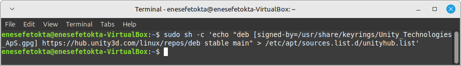

### 3. Adım
Yeni eklenen depoyu sistemin tanıması için paket listesini güncellemek gerekir:
```bash
sudo apt update 
```
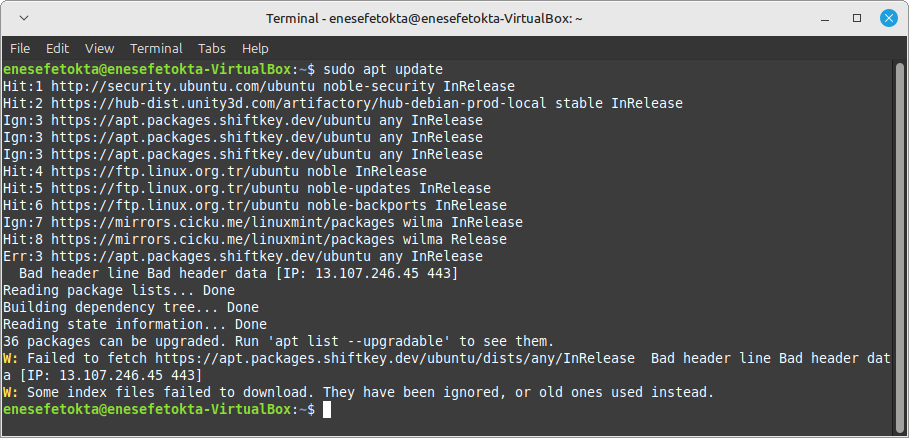

### 4. Adım
Şimdi Unity Hub paketini kurabilirsiniz:
```bash
sudo apt install unityhub
```
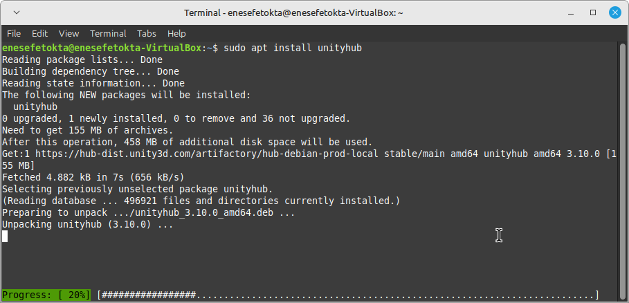

### 5. Adım
Şimdi yerleşik Unity Hub paketini kurabilirsiniz:
```bash
sudo apt install unity-hub
```
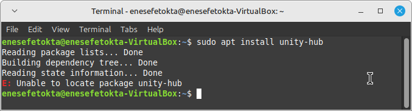

### 6. Adım
Artık Unity Hub 'ı çalıştırabilirsiniz.
```bash
unityhub
```
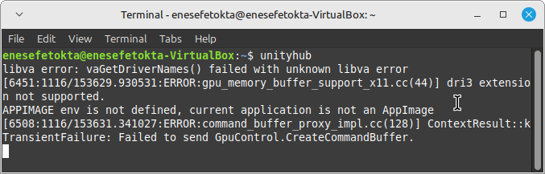

## `cd` Komutu
`cd` (change directory) komutu, terminalde çalışırken dizinler arasında geçiş yapmamızı sağlar. 
Unity geliştiricleri içine bu komutun amacı klasörler arası geçiş yapmamızı sağlar.  
Bu komut, dosya sisteminde gezinmek için temel bir araçtır ve aşağıdaki şekillerde kullanılabilir:

* `cd klasör_adi`: Belirtilen klasöre geçiş yapar. Örneğin, `/home` dizinine geçmek için:
    ```bash
    cd /home
    ```
    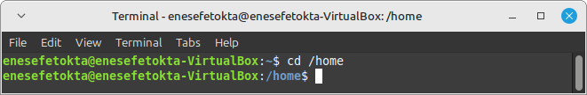

* `cd ..`: Bir üst dizine geçiş yapar. Bu, mevcut dizinin bir üst seviyesine çıkmak için kullanılır.
    ```bash
    cd ..
    ```
    

* `cd .`: Bulunduğunuz dizinde kalır. Bu komut genellikle etkisizdir çünkü mevcut dizini değiştirmez.
    ```bash
    cd .
    ```
    

* `cd ~`: Kullanıcının ana dizinine (home directory) geçiş yapar. Bu, kullanıcıların kişisel dosyalarına hızlıca erişmesini sağlar.
    ```bash
    cd ~
    ``` 
    

* `cd /`: Kök dizine (root directory) geçiş yapar. Bu, dosya sisteminin en üst seviyesine erişmek için kullanılır.
    ```bash
    cd /
    ```
    

`cd` komutu, dosya sisteminde hızlı ve etkili bir şekilde gezinmek için vazgeçilmezdir. Özellikle karmaşık dizin yapılarında çalışırken, doğru dizine hızlıca geçiş yapmak için bu komutun farklı varyasyonlarını kullanabilirsiniz.

## `ls` Komutu
`ls` (list) komutu, bir dizinin içeriğini listelemek için kullanılan temel bir Linux komutudur. Unity projelerinizde dosya ve klasör yönetimi için oldukça faydalıdır. `ls` komutu, dosya ve dizinlerin adlarını, izinlerini, sahiplerini ve diğer bilgilerini görüntülemek için çeşitli seçeneklerle kullanılabilir. İşte `ls` komutunun bazı yaygın ve faydalı kullanımları:

* `ls`: Temel kullanım. Mevcut dizindeki dosya ve klasörleri listeler. Bu, hızlı bir şekilde dizin içeriğini görmek için kullanılır.
    ```bash	
    ls
    ```
    

* `ls -l`: Uzun format. Dosya ve klasörleri ayrıntılı bilgilerle (izinler, sahibi, boyut, değiştirilme tarihi) listeler. Bu, dosya izinlerini ve diğer meta bilgileri görmek için kullanışlıdır.
    ```bash	
    ls -l
    ```
    

* `ls -a`: Gizli dosyaları da gösterir. Unity'de `.meta` dosyaları gibi gizli dosyaları görüntülemek için kullanışlıdır. Gizli dosyalar, genellikle bir nokta (.) ile başlar.
    ```bash
    ls -a
    ```
    

* `ls -la` veya `ls -al`: Uzun format ve gizli dosyaları birleştirir. Tüm dosyaları ayrıntılı bilgilerle listeler. Bu, dizindeki tüm dosyaların tam bir görünümünü sağlar.
    ```bash	
    ls -la
    ```
    

* `ls -lh`: Dosya boyutlarını insan okunabilir formatta (KB, MB, GB) gösterir. Bu, dosya boyutlarını daha anlaşılır bir şekilde görmek için kullanılır.
    ```bash
    ls -lh
    ```
    

* `ls -R`: Alt dizinleri de içerecek şekilde tüm içeriği recursive olarak listeler. Büyük Unity projelerinde dikkatli kullanın, çünkü çok fazla çıktı üretebilir.
    ```bash
    ls -R
    ```
    

* `ls -t`: Dosyaları değiştirilme tarihine göre sıralar (en yeni en üstte). Bu, en son değiştirilen dosyaları hızlıca bulmak için kullanışlıdır.
    ```bash	
    ls -t
    ```
    

* `ls -S`: Dosyaları boyuta göre sıralar (en büyük en üstte). Bu, büyük dosyaları hızlıca bulmak için kullanışlıdır.
    ```bash
    ls -S
    ```
    

### Unity Projeleri İçin Özellikle Faydalı Kullanımlar:
* `ls Assets/`: Assets klasörünün içeriğini listeler. Bu, Unity projenizin ana kaynak dizinini hızlıca incelemek için kullanılır.
* `ls -R *.unity`: Tüm Unity sahne dosyalarını recursive olarak bulur. Bu, projedeki tüm sahneleri listelemek için kullanışlıdır.
* `ls -lh *.asset`: Tüm asset dosyalarını boyutlarıyla birlikte listeler. Bu, hangi asset dosyalarının daha fazla yer kapladığını görmek için kullanışlıdır.

Not: `ls` komutunu farklı seçeneklerle kombine edebilirsiniz. Örneğin, `ls -lhrt` en son değiştirilen dosyaları okunabilir boyutlarıyla birlikte listeler. Bu, dosya yönetimini daha etkili hale getirir.

## `pwd` Komutu
`pwd` komutu, bulunduğumuz dizini gösterir. Bu komut, Unity projelerinde klasörler arasında geçiş yapmak için kullanışlıdır. `pwd` komutunun işlevleri şu şekildedir:

* `pwd`: Bulunduğumuz dizini gösterir.
    ```bash
    pwd 
    ```
    

* `pwd -P`: Dizinlerin tam adını gösterir.
    ```bash
    pwd -P
    ```
    

## `cp` Komutu
`cp` komutu, bir dosya veya klasörü başka bir yere kopyalamak için kullanılır. `cp` komutunun işlevi şu şekildedir:
* `cp dosya_adi yeni_yol`: Dosyayı başka bir yere kopyalar.
    ```bash
    cp dosya_adi yeni_yol
    ```
    

* `cp -r klasör_adi yeni_yol`: Dosya ve alt klasörleri içindeki tüm içeriği kopyalar.
    ```bash    
    cp -r klasör_adi yeni_yol
    ```
    

## `mv` Komutu
`mv` komutu, bir dosya veya klasörü başka bir yere taşımak için kullanılır. `mv` komutunun işlevi şu şekildedir:
* `mv dosya_adi yeni_yol`: Dosyayı başka bir yere taşımak için kullanılır.
    ```bash
    mv dosya_adi yeni_yol
    ```
    

* `mv -r klasör_adi yeni_yol`: Dosya ve alt klasörleri içindeki tüm içeriği taşımak için kullanılır.
    ```bash
    mv -r klasör_adi yeni_yol
    ```
    

## `rm` Komutu
`rm` komutu, bir dosya veya klasörü silmek için kullanılır. `rm` komutunun işlevi şu şekildedir:
* `rm dosya_adi`: Dosyayı silmek için kullanılır.
    ```bash
    rm dosya_adi
    ```
    

* `rm -r klasor_adi`: Klasörü silmek için kullanılır.
    ```bash
    rm -r klasor_adi
    ```
    

## `mkdir` Komutu
`mkdir` komutu, bir yeni klasör oluşturmak için kullanılır. `mkdir` komutunun işlevi şu şekildedir:
* `mkdir klasor_adi`: Yeni bir klasör oluşturur.
    ```bash
    mkdir klasor_adi
    ```
    

* `mkdir -p klasor_adi/klasor_adi`: Yeni klasörü oluşturur ve onun içindeki alt klasörleri de oluşturur.
    ```bash
    mkdir -p klasor_adi/klasor_adi
    ```
    

## `touch` Komutu
`touch` komutu, bir dosya oluşturmak için kullanılır. `touch` komutunun işlevi şu şekildedir:
* `touch dosya_adi`: Yeni bir dosya oluşturur.
    ```bash
    touch dosya_adi
    ```
    

* `touch -a dosya_adi`: Dosyanın son değiştirilme tarihini günceller.
    ```bash
    touch -a dosya_adi
    ```
    

## `ip` Komutu
`ip` komutu, bilgisayarın IP adresini gösterir.
```bash
ip a
```


## `grep` Komutu
`grep` komutu, bir dosyadaki belirli bir kelimeyi aramak için kullanılır. `grep` komutunun işlevi şu şekildedir:
* `grep -R kelime dosya_adi`: Dosyadaki tüm kelimeleri bulur.
    ```bash
    grep -R kelime dosya_adi
    ```
    

* `grep -R -i kelime dosya_adi`: Büyük küçük harf duyarlılığıyla kelimeleri bulur.
    ```bash
    grep -R -i kelime dosya_adi
    ```
    

## `cat` Komutu
`cat` komutu, bir dosyayı okumak için kullanılır. `cat` komutunun işlevi şu şekildedir:
* `cat dosya_adi`: Dosyayı okumak için kullanılır.
    ```bash
    cat dosya_adi
    ```
    

* `cat -n dosya_adi`: Dosyayı okumak için kullanılır ve her satıra bir numara verir.
    ```bash
    cat -n dosya_adi
    ```
    

* `cat dosya1 > dosya2`: İlk dosyanın içeriğini ikinci dosyaya yazdırıyor.
    ```bash
    cat dosya1_adi > dosya2_adi
    ```
    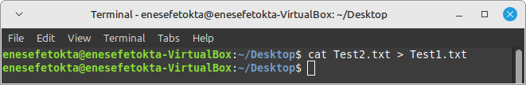

* `cat dosya1 dosya2 > dosya3`: İki dosyayı birleştirerek bir doyaya kayıt eder.
    ```bash
    cat dosya1_adi dosya2_adi > dosya3_adi
    ```
    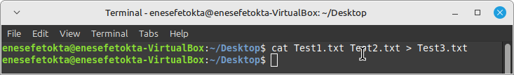


## `ps` Komutu
`ps` komutu, bilgisayardaki oturumların listesini gösterir. `ps` komutunun işlevi şu şekildedir:
* `ps`: Bilgisayardaki oturumların listesini gösterir.
    ```bash
    ps
    ```
    

* `ps aux`: Bilgisayardaki oturumların listesini gösterir ve süreçleri gösterir.
    ```bash
    ps aux
    ```
    

* `ps -u`: Bilgisayardaki oturumların list esini gösterir ve kullanıcı adını gösterir.
    ```bash
    ps -u
    ```
    

* `ps -u -e`: Bilgisayardaki oturumların listesini gösterir ve kullanıcı adını gösterir. 
    ```bash
    ps -u -e
    ```
    

## `ls -R --color=auto` Komutu
`ls -R --color=auto` komutu, klasörlerdeki dosyaları ve alt klasörleri gösterir. `ls -R --color=auto` komutunun işlevi şu şekildedir:
```bash
ls -R --color=auto
```


## `lsmod` Komutu
`lsmod` komutu, modüllerin listesini gösterir. `lsmod` komutunun işlevi şu şekildedir:
* `lsmod`: Modüllerin listesini gösterir.
    ```bash
    lsmod
    ```
    

* `modinfo modül_adi`: Modül hakkında daha fazla bilgi verir.
    ```bash
    modinfo modül_adi
    ```
    

## `gzip` Komutu
`gzip` komutu, ilgili dosyayı sıkıştırarak zip dosyasına çeviriyor. `gzip` komutunun işlevi şu şekildedir:
```bash
gzip dosya_adi
```


## `gunzip` Komutu
`gunzip` komutu, ilgili zip dosyasını açmak için kullanılır. `gunzip` komutunun işlevi şu şekildedir:
```bash	
gunzip zip_dosya_adi
```


## `traceroute` Komutu
`traceroute` komutu, bir sunucuya yollayıp, bu sunucuya kadar gelmek için gerekli olan tüm noktaların IP adreslerini gösterir. `traceroute` komutunun işlevi şu şekildedir:
```bash
traceroute sunucu_adi
```


## `df` Komutu
`df` (disk free) komutu, disk kullanımını ve dosya sistemlerini analiz etmek için kullanılan güçlü bir araçtır. Özellikle disk alanı yönetimi ve performans analizi yaparken vazgeçilmezdir. Unity gibi büyük projeler üzerinde çalışan geliştiriciler için disk alanının verimli yönetimi, projelerin sağlıklı bir şekilde çalışmasını sağlamak açısından hayati önem taşır

### `df` Komutunın Özellikleri
1) **Disk Alanı İzleme:**
    * Büyük Unity projelerinde çok sayıda dosya (script, texture, prefab, vs.) depolandığı için disk alanı hızla tükenebilir. `df` komutu, mevcut disk alanını ve kullanım oranlarını analiz ederek sorunları önceden fark etmenizi sağlar.

2) **Dosya Sistemi Yönetimi:**
    * Dosya sisteminin türünü ve bağlanma noktasını göstererek, projelerinizin hangi disk üzerinde olduğunu ve bu diskin ne kadar dolu olduğunu görebilirsiniz.

3) **Performans Optimizasyonu:**
    * Boş alan azaldığında sistemin yavaşlaması olasıdır. `df` ile bu durumu tespit edip önceden önlem alabilirsiniz.

4) **İntegrasyon Araçları:**
    * Unity projelerinin büyüklüğü nedeniyle, disk yönetimi diğer araçlarla entegre edilebilir. Örneğin, CI/CD süreçlerinde veya yedekleme işlemlerinde `df` çıktıları kullanılabilir.

### `df` Komutunun Kullanım Şekilleri

* `df`: Bu temel kullanım, sistemdeki tüm bağlı dosya sistemlerinin disk kullanımını özetler. Çıktı; dosya sistemi adı, boyutu, kullanılan alan, boş alan ve yüzde doluluk oranını içerir.
    ```bash
    df
    ```
    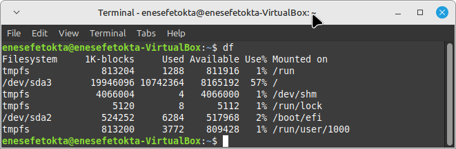

    **Bu komut genellikle şu bilgileri gösterir:**

    * Dosya sistemi: Dosya sisteminin adı veya bağlanma noktası.
    * 1K-blocks: 1KB'lık bloklar cinsinden toplam blok sayısı.
    * Used: Kullanılan blok sayısı.
    * Available: Kullanılabilir blok sayısı.
    * Use%: Kullanım yüzdesi.
    * Mounted on: Dosya sisteminin bağlandığı dizin.

* `df -h`: Bu seçenek, disk boyutlarını MB, GB, TB gibi insan tarafından daha kolay okunabilir bir biçimde gösterir.
    ```bash
    df -h
    ```
    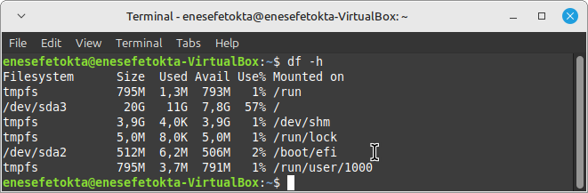

* `df /home`: Belirli bir dizinin hangi disk üzerinde olduğunu ve bu diskteki kullanım durumunu gösterir.
    df /home
    ```
    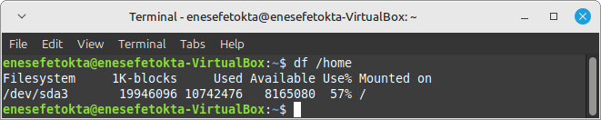

* `df -T`: Bu seçenek, her dosya sisteminin türünü (ext4, NTFS, tmpfs gibi) ve disk kullanımını görüntüler.
    ```bash
    df -T
    ```
    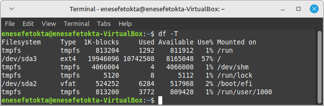

* `df -P`: Bu seçenek, çıktıyı paralel bir şekilde yazdırır. Komut çıktısını diğer programlara veya dosyalara yönlendirmek için idealdir.
    ```bash
    df -P
    ```
    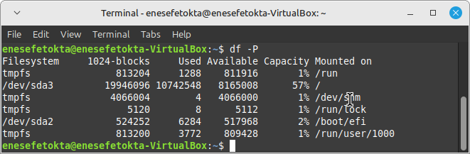

* `df -i`: Bu seçenek, disk üzerindeki inode'ların durumunu gösterir. Her dosya ve dizin bir inode kullanır. Diskte boş alan olsa bile, inode'lar tükenirse yeni dosya oluşturulamaz.
    ```bash
    df -i
    ```
    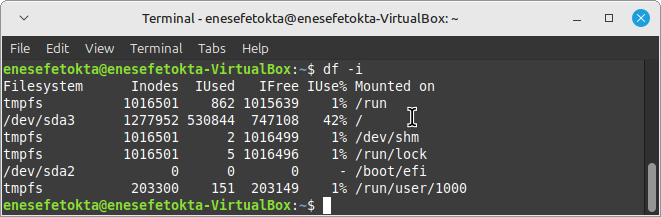

## `du` Komutu
`du` (disk usage), bir dizin ve dosyaların kapladığı disk alanını analiz etmek için kullanılan güçlü bir araçtır. `df` komutunun genel dosya sistemi bilgileri sağlamasına karşın, du komutu daha detaylı ve hedefe yönelik bir analiz sunar. Özellikle projelerinizde hangi dosyaların daha fazla alan kapladığını öğrenmek, gereksiz dosyaları temizlemek ve sistem verimliliğini artırmak için son derece faydalıdır.

### `du` Komutunun Avantajları
1) **Dizin ve Alt Dizinlerin Analizi:**
    * Dizinlerde ve alt dizinlerde hangi dosyaların disk alanını ne kadar kullandığını ayrıntılı şekilde analiz eder.

1) **Büyük Projelerde Kullanım:**
    * Unity gibi büyük projelerde gereksiz dosyaları tespit etmek ve depolama alanını optimize etmek için idealdir.

1) **Kullanıcı Dostu Çıktı:**
    * Disk kullanımını farklı formatlarda sunarak analiz sürecini kolaylaştırır.

1) **Otomasyon ve Entegrasyon:**
    * CI/CD süreçlerinde veya sistem yönetimi script'lerinde kolayca entegre edilebilir.

### `du` Komutunun Kullanım Şekilleri
* `du`: Bu komut hiçbir seçenek olmadan çalıştırdığınızda, geçerli dizinin ve tüm alt dizinlerin disk kullanımını özetler. Unity Geliştiricileri İçin projenizde hangi dizinlerin daha fazla alan kapladığını hızlıca görmek için kullanabilirsiniz.
    ```bash
    du
    ```
    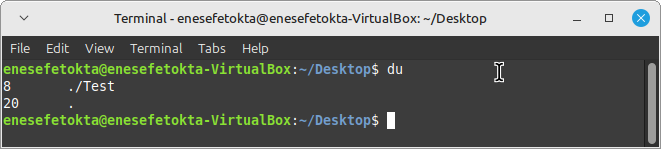

* `du -h`: Disk kullanımını, MB, GB gibi okunabilir formatta gösterir. Unity Geliştiricileri İçin asset boyutlarının anlaşılması açısından daha kolay bir çıktı sağlar. Büyük boyutlu texture veya model dosyalarını tespit etmek için idealdir.
    ```bash
    du -h
    ```
    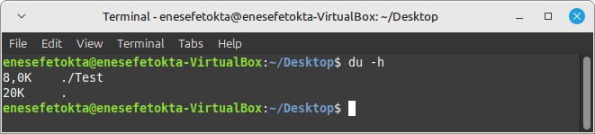

* `du -s`: Sadece belirtilen dizinin toplam boyutunu gösterir. Alt dizinlere ilişkin detayları içermez. Unity Geliştiricileri İçin proje dizininizin toplam boyutunu hızlıca öğrenmek için kullanabilirsiniz.
    ```bash
    du -s
    ```
    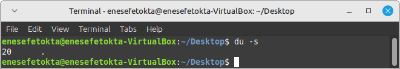

* `du -a`: Dizindeki tüm dosyaların ve alt dizinlerin kapladığı alanı ayrı ayrı listeler. Unity Geliştiricileri İçin tek tek dosyaların disk kullanımını analiz ederek, gereksiz veya büyük dosyaları tespit edebilirsiniz.
    ```bash
    du -a
    ```
    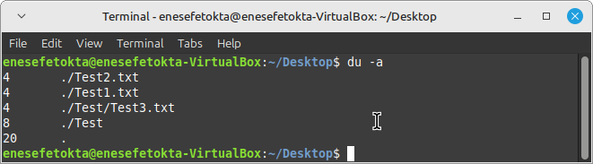

* `du -sh`: Dizinin toplam boyutunu okunabilir formatta gösterir.
    ```bash
    du -sh
    ```
    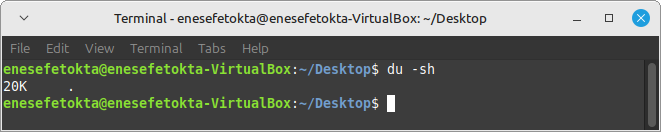

* `du -hc`: Tüm dosya ve dizinlerin boyutlarını ayrı ayrı gösterirken, sonunda toplam disk kullanımını da ekler.
    ```bash
    du -hc
    ```
    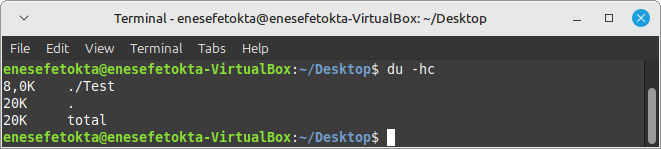

## `dd if=/dev/zero of=testfile bs=1M count=1024 oflag=direct` Komutu
`dd if=/dev/zero of=testfile bs=1M count=1024 oflag=direct` komutu basit ve hızlı bir test için kullanılabilir. Ancak, çok detaylı sonuçlar vermez. Bu komut, /dev/zero cihazından 1MB'lık bloklar halinde 1024 blok (toplam 1GB) veri okuyarak testfile adlı bir dosyaya yazar.
```bash
dd if=/dev/zero of=testfile bs=1M count=1024 oflag=direct
```
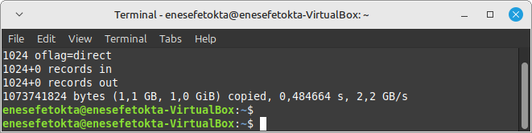

## `iozone -I` Komutu
Farklı dosya boyutları ve erişim desenleri için performans testleri yapar.
```bash
iozone -I
```
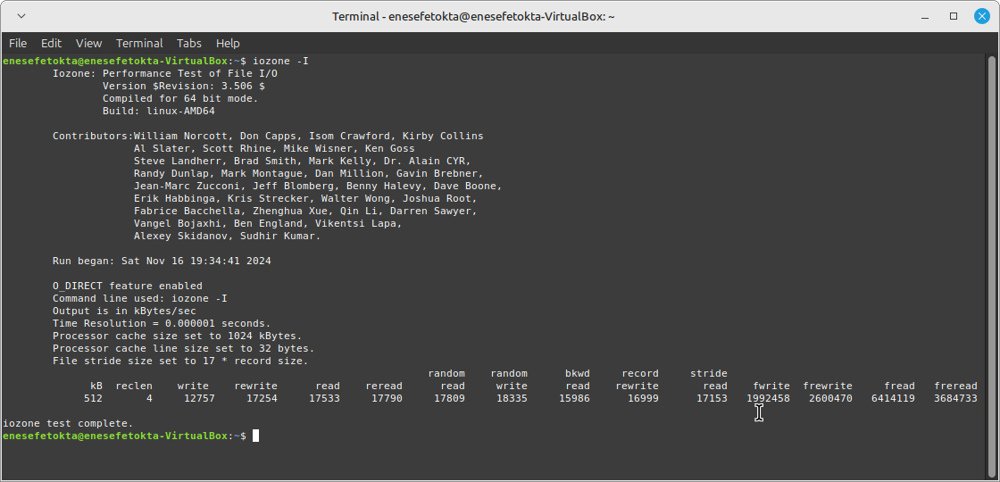

## `exit` Komutu
`exit` komutu, terminal penceresini kapatır.
```bash
exit
```


## `time wget https://speed.hetzner.de/100MB.bin` Komutu
Bu komut, Hetzner'in 100 MB'lık bir dosyasını indirir ve geçen süreyi gösterir.
```bash
time wget https://speed.hetzner.de/100MB.bin
```
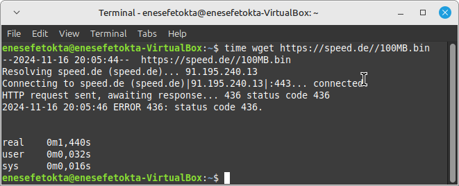

## `time curl -o /dev/null https://speed.hetzner.de/100MB.bin` Komutu
`wget` gibi dosya indirmek için kullanılabilir. Ayrıca, daha gelişmiş HTTP istekleri yapmak için de kullanılabilir.
```bash
time curl -o /dev/null https://speed.hetzner.de/100MB.bin
```
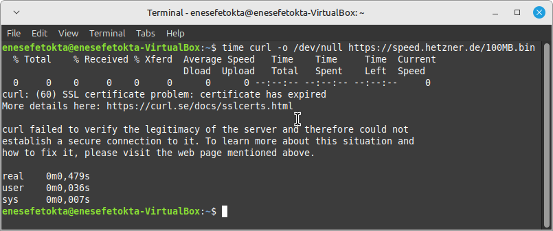

## `free` Komutu
`free` komutu, sistemdeki fiziksel bellek (RAM) ve swap alanının kullanım durumunu gösteren temel bir komuttur. Sisteminizde ne kadar bellek olduğunu, ne kadarının kullanıldığını ve ne kadarının boş olduğunu görmek için kullanılır. `free` komutunun kullanım şekilleri:
* `free`: Temel komuttur. Ram hakkında bilgi verir.
    ```bash
    free
    ```
    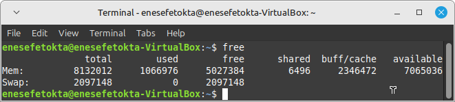

    **Parametre Bilgileri:**
    * **total:** Toplam fiziksel bellek miktarı.
    * **used:** Kullanılan fiziksel bellek miktarı.
    * **free:** Direkt olarak kullanılabilir olan fiziksel bellek miktarı.
    * **shared:** Birden fazla süreç tarafından paylaşılan bellek miktarı.
    * **buff/cache:** Bellek tamponları ve önbelleği tutan alan.
    * **available:** Gerçekte kullanılabilir olan bellek miktarı. Bu değer, buff/cache alanından bir kısmının gerektiğinde serbest bırakılabileceğini varsayar.
    * **Swap:** Swap alanının toplam boyutu, kullanılan kısmı ve boş kısmı.

* `free -m`: Sistemin ne kadar belleğe sahip olduğunu öğrenmek için kullanılır.
    ```bash
    free -m
    ```
    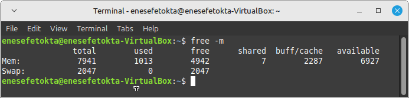

## `top` Komutu
`top` komutu, sistemde çalışan işlemleri gerçek zamanlı olarak görüntüleyen ve analiz etmenizi sağlayan güçlü bir araçtır. Sisteminizde hangi işlemlerin ne kadar CPU ve bellek kullandığını, hangi kullanıcılara ait olduğunu ve daha birçok detayı bu komut sayesinde görebilirsiniz.

### `top` Komutunun Kullanılma Şekilleri
* `top`: Bu komut, terminalde etkileşimli bir arayüz açar. Bu arayüzde sürekli güncellenen bir tablo halinde sisteminizdeki işlemler listelenir.
    ```bash
    top
    ```
    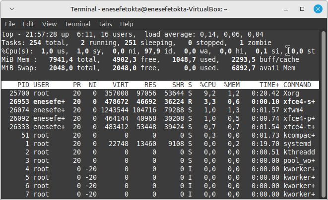

* `top -c`: Bu komut, en çok CPU kullanan 5 işlemi listelemede kullanılıyor.
    ```bash
    top -c
    ```
    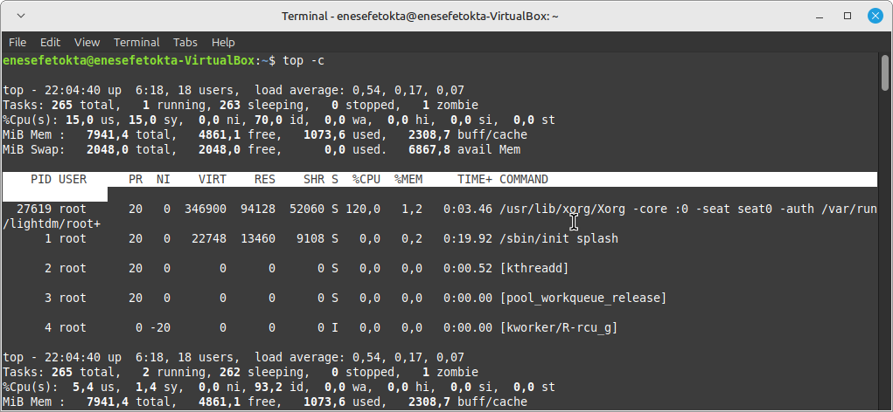

* `top -u`: Bu komut, belirli bir kullanıcının tüm işlemlerini listelemede kullanılıyor.
    ```bash
    top -u kullanici_adi
    ```
    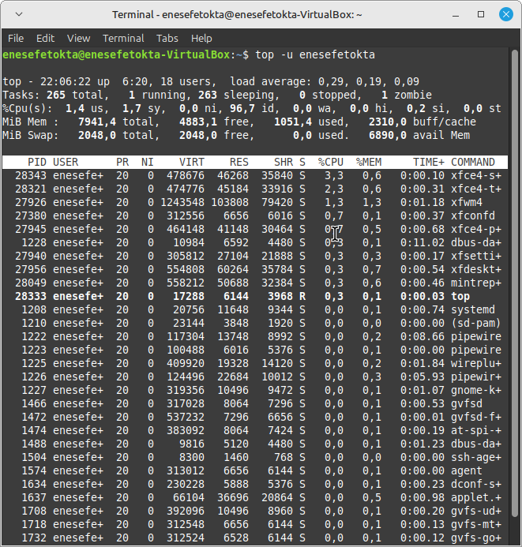

## `htop` Komutu
`htop` komutu, sistemde çalışan işlemleri gerçek zamanlı olarak görüntüleme ve yönetme konusunda top komutuna göre daha gelişmiş ve kullanıcı dostu bir alternatiftir. Renkli ve etkileşimli arayüzü sayesinde sisteminizdeki süreçleri daha kolay takip edebilir ve yönetebilirsiniz.
```bash
htop
```
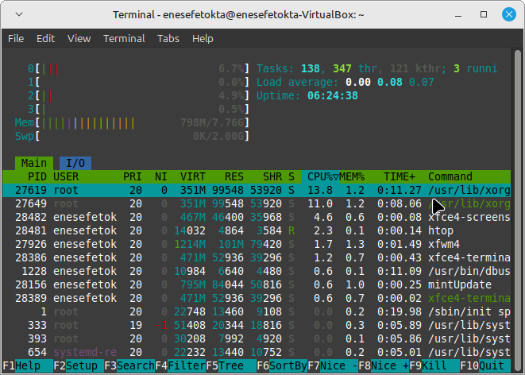

**Kullanırken işinize yarayacak olan bilgiler:**
* **Yardım (F1):** Tüm tuş kısayollarını ve kullanım bilgilerini gösterir.

* **Sıralama:** İşlemleri sıralamak için sütun başlıklarına tıklayabilirsiniz.

* **Filtreleme:** `/` tuşuna basarak bir arama yapabilir ve işlemleri filtreleyebilirsiniz.

* **İşlem Sonlandırma:** İşlemin üzerine gelin ve `k` tuşuna basarak işlemi sonlandırabilirsiniz.

* **Nicelik Değiştirme:** İşlemin üzerine gelin ve `r` tuşuna basarak niceliğini değiştirebilirsiniz.

## Kaynaklar
|Bağlantı Linki|Kaynak|
|:---:|:---:|
| [Medium](https://medium.com/@ritusherke86/top-50-linux-commands-560b56343d00) |  |
| [YouTube](https://www.youtube.com/watch?v=gd7BXuUQ91w) |  |

## İletişim
* [LinkedIn](https://www.linkedin.com/in/enes-efe-tokta/ "Click on Enes Efe Tokta's LikedIn connection link.")
* [GitHub](https://github.com/EnesEfeTokta "Enes Efe Tokta's Github profile.")
* [Email](enesefetokta009@gamil.com  "Click on Enes Efe Tokta's Email.")

## Katkıda Bulunma
1. Bu depoyu forklayın.
2. Kendi özelliğinizi geliştirin (`feature/your-feature-name` dalını oluşturun).
3. Değişikliklerinizi bu repo ile birleştirmek için bir **Pull Request** oluşturun.

## Proje Bilgileri
Bu doküman, Atatürk Üniversitesi Bilişim Sistemleri ve Teknolojileri Bölümü'nde yürütülen İşletim Sistemleri dersi kapsamında hazırlanmış bir akademik çalışmadır. Projenin geliştiricisi Enes Efe Tokta tarafından *6 Kasım 2024* ile *18 Kasım 2024* tarihleri arasında titizlikle hazırlanmış ve dersin ilk ara sınav ödevi olarak sunulmuştur.

Bu çalışma, Linux işletim sistemi komutlarını Unity geliştirme ortamı bağlamında incelemekte ve açıklamaktadır. Doküman, hem akademik hem de pratik amaçlara hizmet etmek üzere tasarlanmıştır.

© 2024 Enes Efe Tokta. Tüm hakları saklıdır. [LICENSE](https://github.com/EnesEfeTokta/Unity-Windows-Commands/blob/main/LICENSE "Click on LICENSE file.")